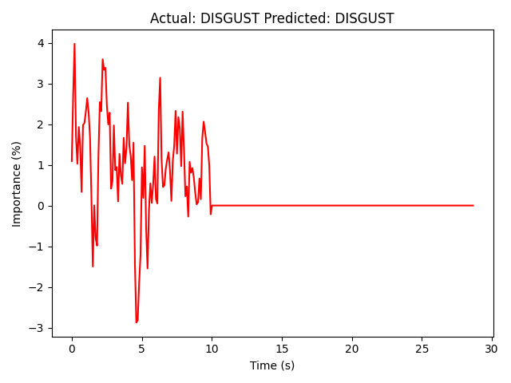
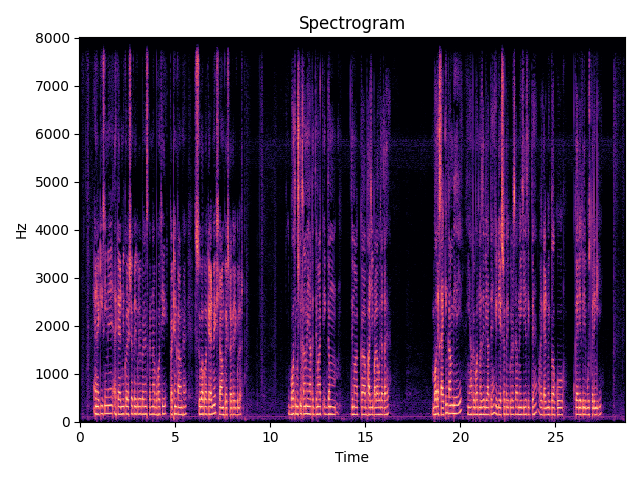
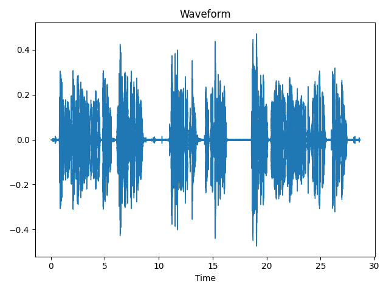
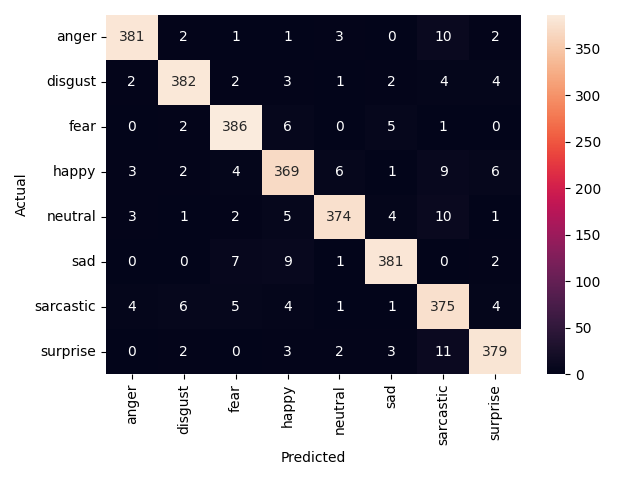

# 🎙️ Speech Recognition and Emotion Detection


A real-time **Speech Emotion Recognition (SER)** system that analyzes human speech and predicts emotional states using deep learning while also providing interpretable explanations of model decisions.

This project combines **speech processing**, **deep learning**, and **Explainable AI (XAI)** to understand not just *what emotion is being spoken*, but also *why the model predicted it*.

The system extracts speech features such as **MFCCs, Chroma, Mel Spectrograms, Spectral Contrast, Tonnetz, Pitch, and Energy**, and uses a **CNN-GRU-Attention** architecture for emotion classification.

To improve transparency, the system integrates **Local Model-Agnostic Classification (LMAC)** for post-hoc interpretability.

This work was developed as my final-year undergraduate research project at **National Institute of Technology Calicut** and was accepted at **CVIP 2025 (IIT Ropar)**.

---

## 🚀 Why This Project?

Speech carries more than words — it carries emotions.

Traditional speech recognition systems focus on *what is being said*, but emotional intelligence in AI requires understanding *how it is being said*.

This project aims to bridge that gap by making speech systems:

* More emotionally aware
* More interpretable
* More trustworthy
* More suitable for real-world human-centric AI applications

### Applications

* Virtual Assistants
* Mental Health Monitoring
* Customer Support Analytics
* Human-Computer Interaction
* Emotion-Aware Chatbots
* Smart Call Center Systems

---

## ✨ Features

- Real-time Speech Emotion Recognition  
- CNN-GRU-Attention based architecture  
- Advanced speech feature extraction  
- Explainable AI using LMAC  
- Interactive Streamlit web application  
- Upload custom audio files for prediction  
- Waveform visualization  
- Spectrogram visualization  
- Emotion prediction with interpretability  
- Hybrid dataset training approach  
- Post-hoc model explanation support  

---

## 🧠 Model Architecture

The emotion detection pipeline follows:

```text
Audio Input
   ↓
Preprocessing
   ↓
Feature Extraction
(MFCC + Chroma + Mel + Tonnetz + Contrast + Pitch + Energy)
   ↓
CNN Layers
   ↓
Bi-Directional GRU
   ↓
Attention Layer
   ↓
Dense Layers
   ↓
Softmax Classification
   ↓
Emotion Prediction
   ↓
LMAC Explainability
```

---

## 🎯 Emotion Classes

The model classifies speech into:

* Angry
* Disgust
* Fear
* Happy
* Neutral
* Sad
* Sarcastic
* Surprise

---

## 📁 Dataset Information

This project follows a **two-stage hybrid dataset approach** for improving Speech Emotion Recognition performance.

### 1. BhavanaVani (Custom Dataset)

BhavanaVani is a custom Hindi emotional speech dataset initiated during this project.

We initially collected emotion-labeled speech samples from students at **National Institute of Technology Calicut**.

Challenges faced:

- Limited participation  
- Class imbalance  
- Low sample count  
- Difficulty in collecting natural emotional speech  

This dataset helped establish the initial training pipeline and validate the feature extraction process.

---

### 2. Kaggle Hindi SER Dataset

To overcome data limitations and improve model generalization, we incorporated a larger Hindi Speech Emotion Recognition dataset from Kaggle.

This improved:

- Dataset diversity  
- Better emotion balance  
- Stronger model robustness  
- Improved generalization capability  

Final hybrid dataset size: **3200+ audio samples**

---

## 🛠️ Tech Stack

### Programming & Frameworks

* Python
* TensorFlow
* Streamlit

### Audio Processing

* Librosa
* NumPy
* Pandas

### Machine Learning

* Scikit-learn
* StandardScaler
* LabelEncoder

### Deep Learning

* CNN
* Bi-Directional GRU
* Attention Mechanism

### Explainability

* Local Model-Agnostic Classification (LMAC)

---

## 📂 Project Structure

   bash
emotion-app/
│── model/                         # Saved trained model files
│── script/                        # Training, preprocessing and evaluation scripts
│── screenshots/                   # Prediction outputs and visualizations
│   ├── prediction_output.png
│   ├── spectrogram.png
│   ├── waveform.png
│   ├── kaggle_confusion_matrix.png
│── README.md                      # Project documentation
│── requirements.txt               # Required dependencies
│── emotions.csv                   # Emotion labels dataset
│── confusion_matrix_eval.png      # BhavanaVani confusion matrix

---

## ⚙️ Installation & Setup

### 1. Clone the repository

```bash
git clone https://github.com/build-with-saurav/emotion-app.git
cd emotion-app
```

### 2. Install dependencies

```bash
pip install -r requirements.txt
```

### 3. Run the application

```bash
streamlit run app.py
```

---

## 📸 Application Screenshots

### Prediction Output

Shows the predicted emotion from uploaded speech.



---

### Spectrogram Visualization

Displays time-frequency representation of speech.



---

### Waveform Visualization

Shows amplitude variation over time.



---

## 📊 Model Performance

The model was trained using a **two-stage hybrid dataset strategy**.

### Phase 1 — BhavanaVani (Custom Dataset)

The initial model was trained using the custom BhavanaVani dataset collected from students at **National Institute of Technology Calicut**.

This phase helped validate:

- Feature extraction pipeline  
- Emotion labeling consistency  
- Initial model architecture  
- Dataset quality assessment  

### BhavanaVani Confusion Matrix

The confusion matrix below shows the model’s classification performance on the custom BhavanaVani dataset.


---

### Phase 2 — Kaggle Hindi SER Dataset

To overcome limitations in dataset size and improve generalization, the model was extended using a publicly available Hindi SER dataset from Kaggle.

This improved:

- Data diversity  
- Class balance  
- Better robustness  
- Stronger generalization  

### Official Research Results (CVIP 2025)

These are the official performance metrics reported in the accepted research paper:

- **Training Accuracy:** 99.71%  
- **Validation Accuracy:** 72.34%  

---

### Extended Kaggle Experiment (Post-Research)

After integrating the Kaggle Hindi SER dataset, the model achieved:

- **Overall Confusion Matrix Accuracy:** 94.59%  

### Kaggle Dataset Confusion Matrix

The confusion matrix below shows the final classification performance after training on the extended Kaggle dataset.



---

### Class-wise F1 Scores

- Anger → **83.1%**  
- Fear → **77.7%**  
- Sad → **73.2%**  
- Surprise → **71.3%**  
- Neutral → **68.0%**  
- Happy → **65.3%**  
- Disgust → **64.1%**  
- Sarcastic → **60.8%**


---

## 🔍 Explainability Metrics (LMAC)

To improve transparency, the model uses **LMAC** to identify important speech segments contributing to predictions.

### Interpretability Performance

* **Mask-In L2I Score:** 0.91
* **Mask-Out L2I Score:** 0.83
* **Structural AUC:** 0.88
* **Average Gain:** 12.7%
* **Average Drop:** 8.1%
* **Sparseness:** 61.4%
* **Complexity Index:** 0.37

These metrics demonstrate strong faithfulness and high-quality interpretability.

---

## 🔬 Research Contribution

This project contributed to the research paper:

**SPASHTA — Speech Posthoc Attribution with Salient Highlighting for Transparent Analysis**

Accepted at:

**Conference on Computer Vision and Image Processing (CVIP 2025), IIT Ropar**

📄 Research Paper: [View Paper](research-paper/SPASHTA_CVIP_2025.pdf)  
📝 Reviewer Feedback: [View Reviews](reviews/CVIP_Review_Comments.pdf)

This research focuses on improving transparency and trust in Speech Emotion Recognition systems using Explainable AI techniques.

### Key Contributions

- Initiated the custom **BhavanaVani** Hindi emotional speech dataset collection at NIT Calicut  
- Designed and structured the speech data collection pipeline  
- Identified limitations in low-resource speech collection and expanded the dataset using Kaggle Hindi SER data  
- Built a hybrid dataset for improved model robustness and generalization  
- Developed a **CNN-GRU-Attention** based Speech Emotion Recognition pipeline  
- Integrated **Local Model-Agnostic Classification (LMAC)** for post-hoc interpretability  
- Evaluated explanation quality using structural and fidelity-based metrics  
- Improved transparency in low-resource Indic language Speech Emotion Recognition  
- Validated explanation quality using both empirical and human-based evaluation  

This work bridges the gap between **high-performance Speech Emotion Recognition** and **interpretable AI systems**, making emotion-aware speech applications more trustworthy.

---

## 📝 Peer Review Highlights

The work received positive peer-review feedback for:

* Novelty in Explainable AI for Speech Emotion Recognition
* Human-understandable listenable explanations
* Applicability in low-resource Indic language settings
* Strong interpretability framework

---

## 🔮 Future Improvements

* Real-time microphone support
* Transformer-based architectures (Wav2Vec2, HuBERT, Whisper)
* Multilingual emotion recognition
* Model compression for mobile deployment
* Noise-robust emotion classification
* Multimodal emotion recognition (audio + video + text)
* Emotion trajectory tracking

---

## 👨‍💻 Author

**Saurav Kumar Singh**  
B.Tech in Computer Science and Engineering  
National Institute of Technology Calicut  

AI/ML Engineer | Speech AI | Deep Learning | Explainable AI  

🔗 GitHub: https://github.com/build-with-saurav

---

## 📜 License

This project is intended for educational and research purposes only.
